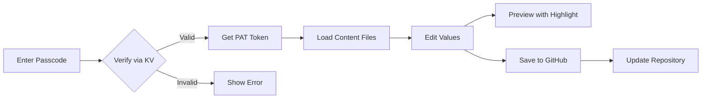

# Admin Panel Implementation Walkthrough

## Summary

Successfully implemented a content management admin panel at `/admin-spacefurnio` with:

- Passcode authentication via Cloudflare KV
- GitHub API integration for updating content files
- Premium, responsive UI with sidebar navigation
- Live preview with element highlighting

---

## Files Changed

### Backend (Cloudflare Workers)

| Action    | File                                                                                                                      | Description                                        |
| --------- | ------------------------------------------------------------------------------------------------------------------------- | -------------------------------------------------- |
| ➕ NEW    | [contentAdmin.js](file:///home/santhoshmk/EDUCATION%20CONTENT/Freelancing/spacefurnio/backend/src/routes/contentAdmin.js) | Passcode verification, file listing, GitHub update |
| ✏️ MODIFY | [index.js](file:///home/santhoshmk/EDUCATION%20CONTENT/Freelancing/spacefurnio/backend/src/index.js)                      | Added content admin routes import                  |
| ✏️ MODIFY | [wrangler.jsonc](file:///home/santhoshmk/EDUCATION%20CONTENT/Freelancing/spacefurnio/backend/wrangler.jsonc)              | Added ADMIN_SECRETS KV namespace                   |

---

### Frontend (Vue.js)

| Action    | File                                                                                                                                        | Description                                   |
| --------- | ------------------------------------------------------------------------------------------------------------------------------------------- | --------------------------------------------- |
| ➕ NEW    | [AdminView.vue](file:///home/santhoshmk/EDUCATION%20CONTENT/Freelancing/spacefurnio/frontend/src/views/AdminView.vue)                       | Main wrapper with passcode login              |
| ➕ NEW    | [AdminLayout.vue](file:///home/santhoshmk/EDUCATION%20CONTENT/Freelancing/spacefurnio/frontend/src/components/admin/AdminLayout.vue)        | Sidebar layout with navigation                |
| ➕ NEW    | [AdminContentsPage.vue](file:///home/santhoshmk/EDUCATION%20CONTENT/Freelancing/spacefurnio/frontend/src/views/admin/AdminContentsPage.vue) | Content file management                       |
| ➕ NEW    | [ContentEditor.vue](file:///home/santhoshmk/EDUCATION%20CONTENT/Freelancing/spacefurnio/frontend/src/components/admin/ContentEditor.vue)    | Key-value content editor                      |
| ➕ NEW    | [PreviewModal.vue](file:///home/santhoshmk/EDUCATION%20CONTENT/Freelancing/spacefurnio/frontend/src/components/admin/PreviewModal.vue)      | Preview with element highlighting             |
| ✏️ MODIFY | [index.js](file:///home/santhoshmk/EDUCATION%20CONTENT/Freelancing/spacefurnio/frontend/src/router/index.js)                                | Added admin routes                            |
| ✏️ MODIFY | [App.vue](file:///home/santhoshmk/EDUCATION%20CONTENT/Freelancing/spacefurnio/frontend/src/App.vue)                                         | Hide nav/footer for admin, highlight elements |

---

## Setup Instructions

### 1. Create Cloudflare KV Namespace

Run this command in your backend directory:

```bash
cd backend
npx wrangler kv:namespace create ADMIN_SECRETS
```

This will output something like:

```
⛅ wrangler 3.x.x
🌀 Creating namespace ADMIN_SECRETS...
✨ Success! Add the following to your wrangler.jsonc:
{ binding = "ADMIN_SECRETS", id = "abc123..." }
```

### 2. Update wrangler.jsonc

Replace `ADMIN_SECRETS_KV_ID_HERE` in your `wrangler.jsonc` with the actual ID from the previous step:

```jsonc
{
	"binding": "ADMIN_SECRETS",
	"id": "paste-your-actual-id-here"
}
```

### 3. Create GitHub PAT Token

1. Go to [GitHub Settings > Developer settings > Personal access tokens](https://github.com/settings/tokens)
2. Click **"Generate new token (classic)"**
3. Give it a name like "Spacefurnio Admin"
4. Select scope: `repo` (Full control of private repositories)
5. Click **Generate token**
6. **Copy the token immediately** (you won't see it again!)

### 4. Add PAT to Cloudflare KV

Run this command to store your passcode and PAT token:

```bash
cd backend
npx wrangler kv:key put --binding ADMIN_SECRETS "admin-spacefunio.in" '{"pat":"<git_pat>","repo":"devsanthoshmk/spacefurnio","branch":"main"}'
```

> [!IMPORTANT]
> Replace `ghp_YOUR_TOKEN_HERE` with your actual GitHub PAT token.

---

## How It Works



### Authentication Flow

1. User navigates to `/admin-spacefurnio`
2. Enters passcode `admin-spacefunio.in`
3. Backend verifies against Cloudflare KV
4. Returns PAT token for session
5. Token stored in sessionStorage (expires on tab close)

### Content Editing Flow

1. Click on **Contents** in sidebar
2. Content files are loaded from GitHub
3. Each key is shown with human-readable label
4. Edit values inline
5. Changes are stored in **localStorage** (persists across refreshes)
6. Click **"Save to GitHub"** to commit changes
7. Changes are pushed to `main` branch

### Preview Feature

1. Click the **👁 eye icon** next to any field
2. Modal opens with iframe showing the live page
3. Element with matching `data-key` attribute is highlighted
4. Scroll position automatically moves to highlighted element

---

## Usage

### Access Admin Panel

1. Navigate to: `http://localhost:5173/admin-spacefurnio`
2. Enter passcode: `admin-spacefunio.in`
3. You'll see the admin dashboard

### Edit Content

1. Click **"Contents"** in the sidebar
2. Select a content file (e.g., `homePage.json`)
3. Edit any value in the input fields
4. Your changes are auto-saved to localStorage
5. Click **"Save to GitHub"** to push changes

### Preview Changes

1. Click the **👁 icon** next to any field
2. A modal will show the live page
3. The element using that content key will be highlighted
4. Close modal and continue editing

---

## Screenshots

The admin panel features:

- Clean, modern sidebar with icons
- Premium passcode login screen
- Grid-based content editor
- Live preview modal with highlighting
- Success/error toast notifications

---

## Security Notes

> [!CAUTION]
>
> - The PAT token has repository write access
> - Store the passcode securely
> - Rotate the PAT token periodically
> - Never commit PAT tokens to the repository

---

## Next Steps

- [ ] Test the complete flow locally
- [ ] Verify GitHub updates work correctly
- [ ] Deploy backend to Cloudflare
- [ ] Test in production
